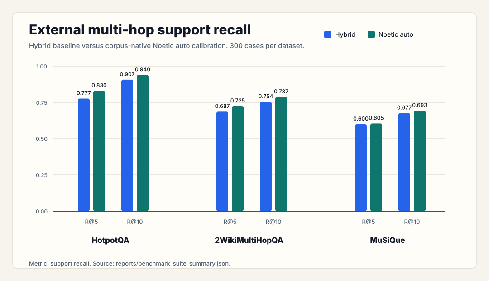

  <section class="hero">
    
Core thesis

    <h1>Broad retrieval for recall. Graph reconciliation for precision.</h1>
    

      Noetic Search is a post-retrieval reconciliation layer for hybrid search.
      Hybrid retrieval finds plausible candidates; Noetic builds a local graph,
      preserves strong retrieval anchors, and promotes graph-connected support
      chunks into a compact evidence set.
    

  </section>

  <section class="grid two">
    <article>
      <h2>Standard Hybrid</h2>
      <pre>query -> hybrid search -> top 5 chunks -> LLM</pre>
      

        The LLM receives raw rank. If the first five chunks are stale,
        repetitive, or shallow, the model has to repair retrieval inside the
        prompt.
      

    </article>
    <article>
      <h2>Noetic Search</h2>
      <pre>query -> candidates
      -> graph
      -> linked-evidence ranking
      -> result -> LLM</pre>
      

        The LLM receives a selected evidence surface, not a pile of nearest
        neighbors.
      

    </article>
  </section>

  <section class="grid three">
    <article>
      <h2>What It Does</h2>
      

        It turns a broad candidate field into a smaller, connected evidence set
        before the LLM sees the prompt.
      

    </article>
    <article>
      <h2>What It Does Not Do</h2>
      

        It does not replace vector search, BM25, rerankers, or LLM reasoning. It
        changes the step after candidate retrieval.
      

    </article>
    <article>
      <h2>Current Signal</h2>
      

        Focused ablations show that the lift comes from anchor-linked graph
        promotion. Hybrid finds strong entry points; Noetic promotes candidates
        connected to those anchors. Static graph defaults already improve
        hybrid, while corpus-native <code>auto</code> adds a smaller gain.
      

    </article>
  </section>

  <section class="panel">
    
Ablation result

    <h2>The useful signal is anchor-linked promotion.</h2>
    

      On the 100-case linked-production ablation across HotpotQA,
      2WikiMultiHopQA, and MuSiQue, raw hybrid averaged <code>0.738</code>
      recall across <code>@5</code> and <code>@10</code>. Static linked Noetic
      averaged <code>0.777</code>; auto-calibrated linked Noetic averaged
      <code>0.783</code>. Anchors alone matched hybrid, and support-only graph
      ranking fell to <code>0.501</code>.
    

    

      The production claim is therefore narrow: preserve first-stage hybrid
      anchors, then use the local graph to promote connected support chunks.
      Calibration remains useful configuration work, but it is not the main
      source of the measured lift.
    

  </section>

  <section class="panel figure-panel">
    
Benchmark signal

    <h2>The auto path improves compact support recall in the headline run.</h2>
    
  </section>

  <section class="panel">
    
Ablation key

    <h2>The ablation separates the mechanism from the surrounding graph.</h2>
    

      The focused ablation compares mean support recall across <code>@5</code>
      and <code>@10</code>. Raw hybrid scores <code>0.738</code>.
      Auto-calibrated linked Noetic scores <code>0.783</code>, a 4.5
      percentage-point absolute gain and a 6.1% relative improvement over
      hybrid.
    

    <pre>variant                 mean recall across @5/@10
hybrid                  0.738
linked_static           0.777
linked_auto             0.783
anchors_only            0.738
no_anchor_affinity      0.756
anchor_affinity_only    0.780
support_only            0.501
semantic_only           0.743
lexical_only            0.742</pre>
    

      
<code>hybrid</code>Baseline hybrid ranking, with no Noetic reconciliation.

      
<code>linked_static</code>Anchor-linked graph ranking with fixed default graph weights.

      
<code>linked_auto</code>Anchor-linked graph ranking with corpus-calibrated graph weights.

      
<code>anchors_only</code>Preserved hybrid anchors only; tests whether the result is merely the original top hybrid hits.

      
<code>no_anchor_affinity</code>Graph ranking without the direct anchor-affinity term; tests whether generic graph structure is enough.

      
<code>anchor_affinity_only</code>Candidates ranked only by their strongest graph edge to a preserved hybrid anchor.

      
<code>support_only</code>Candidates ranked only by weighted graph degree; tests broad graph centrality by itself.

      
<code>semantic_only</code>Graph edges built from embedding similarity only.

      
<code>lexical_only</code>Graph edges built from lexical salience overlap only.

    

    

      The pattern is the important part. Anchors alone reproduce hybrid.
      Support-only graph ranking performs poorly. The lift comes from promoting
      candidates connected to strong hybrid anchors.
    

  </section>

  <section class="grid two">
    <article>
      <h2>Agreement</h2>
      

        A relationship is strongest when semantic similarity and lexical
        salience both support it. Agreement edges are the preferred paths for
        promoting lower-ranked support chunks.
      

    </article>
    <article>
      <h2>Tension</h2>
      

        A relationship is riskier when semantic similarity is high but lexical
        anchoring is weak, or when surface overlap lacks conceptual fit. The
        graph tracks this as bridge risk rather than treating every neighbor as
        support.
      

    </article>
  </section>

  <section class="panel">
    
Return surfaces

    <h2>One reconciliation result, multiple caller views.</h2>
    

      
<code>chunks()</code>Compact LLM-ready chunks from the linked-evidence return policy.

      
<code>strongest_basin()</code>The strongest diagnostic basin when diagnostics are requested.

      
<code>evidence_field()</code>The inspection field: linked return, optional basins, support edges, uncertainty, and graph metrics.

    

  </section>

  <section class="panel">
    
Implementation

    <h2>The core path is intentionally small.</h2>
    <pre>Database
  -> SemanticSearch + LexicalSearch
  -> HybridSearch
  -> Reconciler.reconcile()
  -> ReconciliationResult
  -> chunks()

optional diagnostics:
  -> strongest_basin() or evidence_field()</pre>
  </section>

  <section class="grid two">
    <article>
      <h2>The Math</h2>
      

        The production path: candidates, graph construction, linked-evidence
        ranking, and result formatting.
      

      
<a href="process/">Open The Math</a>

    </article>
    <article>
      <h2>Evidence Graph</h2>
      

        The relationship model: agreement edges, bridge risk, surface overlap
        risk, and redundancy pressure.
      

      
<a href="evidence_graph/">Open Evidence Graph</a>

    </article>
  </section>

  <section class="grid two">
    <article>
      <h2>Auto Calibration</h2>
      

        The corpus-native process that selects frozen graph weights before
        query-time retrieval.
      

      
<a href="auto_calibration/">Open Auto Calibration</a>

    </article>
    <article>
      <h2>Spectral Diffusion</h2>
      

        The diagnostic path: Laplacian splitting, diffusion time steps, basin
        scoring, uncertainty, and how this research path audits the graph.
      

      
<a href="spectral_diffusion/">Open Spectral Diffusion</a>

    </article>
  </section>

  <section class="grid two">
    <article>
      <h2>Production Trace</h2>
      

        A real HotpotQA case where hybrid top-5 recovers one supporting
        paragraph and Noetic linked top-5 recovers both. This is the benchmarked
        path: candidates, graph, linked ranking, result.
      

      
<a href="trace/">Open the production trace</a>

    </article>
    <article>
      <h2>Diagnostic Trace</h2>
      

        The same HotpotQA case viewed through spectral basins, whole-graph
        diffusion, basin-constrained diffusion, and basin scoring. This view
        uses the corpus-native <code>auto</code> graph formula so the same case
        exposes multiple diagnostic basins.
      

      
<a href="diagnostics_trace/">Open the diagnostic trace</a>

    </article>
  </section>

